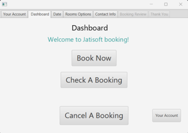
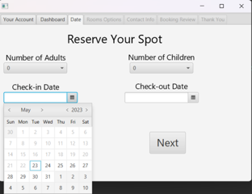
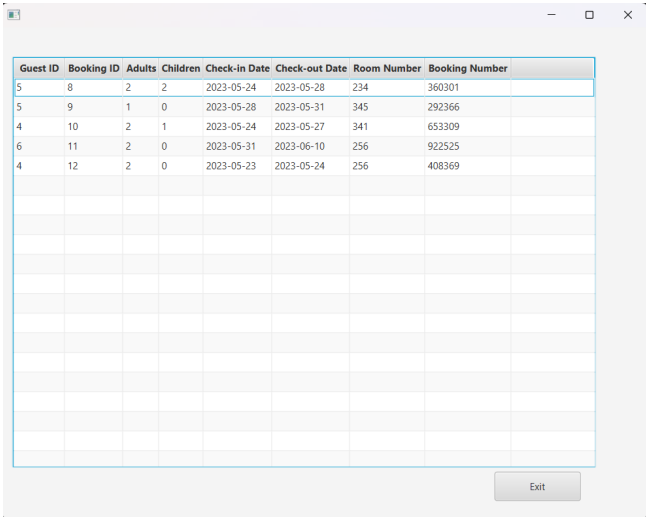

# Jatisoft Hotel Booking Application

## Introduction

Jatisoft is a comprehensive booking system designed to streamline the reservation process for hotels and other accommodation providers. The application allows users to manage existing reservations, handle guest information, send automated emails, and handle various aspects of room reservations.

## Getting Started

To run the Jatisoft Booking App, follow these steps:

1. Clone the repository: git clone https://github.com/tuho9428/JatisoftBooking.git
2. Navigate to the cloned directory: cd JatisoftBooking
3. Execute the main java file: JatisoftApp.java

## Usage

### Regular User

Regular users can:

- Make new reservations
- Modify existing reservations
- View booking history
- Update personal information

**Regular User Credentials:**
- Username: user1
- Password: 1234

### Administrator

Administrators have additional privileges:

- Manage room availability
- Handle guest requests
- Generate reports
- Access the entire guest database
- Add or modify rooms

**Administrator Credentials:**
- Username: admin
- Password: 123

## Features

- Streamlined reservation process
- Automated email notifications for guests
- User-friendly interface
- Efficient management of reservations and guest information
- Comprehensive administrative capabilities

## Demo Screenshots

### Reservation Form

### Report Generation

## Contributing

If you'd like to contribute to Jatisoft, please follow these steps:

1. Fork the repository
2. Create your feature branch (`git checkout -b feature/YourFeature`)
3. Commit your changes (`git commit -am 'Add some feature'`)
4. Push to the branch (`git push origin feature/YourFeature`)
5. Create a new Pull Request

## Contact

For any inquiries or support, please contact [Tu Ho](mailto:ht@cwu.edu).

